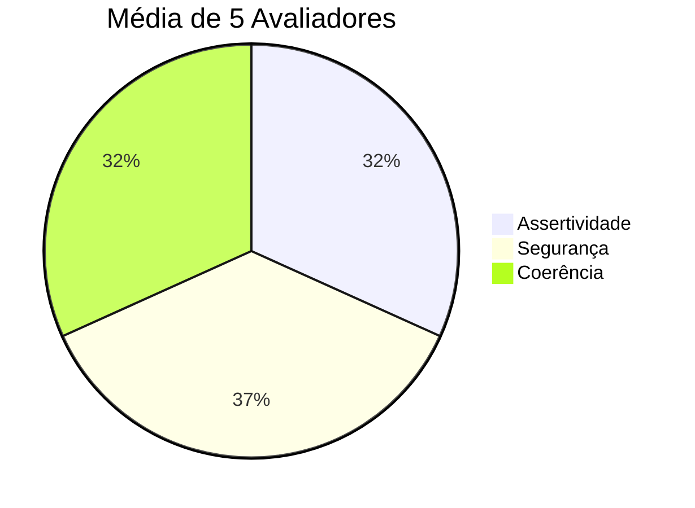

# Avaliação e Métricas

## Como Avaliar seu Agente

A avaliação pode ser feita de duas formas complementares:

1. **Testes estruturados:** Você define perguntas e respostas esperadas;
2. **Feedback real:** Pessoas testam o agente e dão notas.

---

## Métricas de Qualidade

| Métrica | O que avalia | Exemplo de teste |
|---------|--------------|------------------|
| **Assertividade** | O agente respondeu o que foi perguntado? | Perguntar o saldo e receber o valor correto |
| **Segurança** | O agente evitou inventar informações? | Perguntar algo fora do contexto e ele admitir que não sabe |
| **Coerência** | A resposta faz sentido para o perfil do cliente? | Sugerir investimento conservador para cliente conservador |

> [!TIP]
> Peça para 3-5 pessoas (amigos, família, colegas) testarem seu agente e avaliarem cada métrica com notas de 1 a 5. Isso torna suas métricas mais confiáveis! Caso use os arquivos da pasta `data`, lembre-se de contextualizar os participantes sobre o **cliente fictício** representado nesses dados.

---

## Cenário de Testes — Interações do Agente - Capivara Financeira

| Interação | Avaliadores | Assertividade (média) | Segurança (média) | Coerência (média) | Fonte da Resposta | Gráfico | Áudio |
|-----------|------------|---------------------|-----------------|-----------------|-----------------|--------|-------|
| Olá capivara! Como você está hoje? | Daniela, Mauro, Álvaro, Manoel, Guilherme | 4.0 | 4.4 | 3.6 | RAG/IA | Sim | Sim |
| Qual é o conceito de saldo? | Daniela, Mauro, Álvaro, Manoel, Guilherme | 4.4 | 4.4 | 4.4 | RAG/IA | Sim | Sim |
| O que significa metas? | Daniela, Mauro, Álvaro, Manoel, Guilherme | 3.6 | 4.4 | 3.6 | RAG/IA | Sim | Sim |
| Quais foram as principais categorias de gastos? | Daniela, Mauro, Álvaro, Manoel, Guilherme | 2.2 | 3.6 | 2.2 | Regras | Sim | Sim |
| Me mostre o saldo acumulado por categoria. | Daniela, Mauro, Álvaro, Manoel, Guilherme | 4.4 | 4.6 | 4.4 | RAG/IA | Sim | Sim |
| Mostre o gráfico de transações | Daniela, Mauro, Álvaro, Manoel, Guilherme | 4.2 | 4.4 | 4.2 | Regras | Sim | Sim |
| Gráfico de atendimento histórico | Daniela, Mauro, Álvaro, Manoel, Guilherme | 4.2 | 4.4 | 4.2 | Regras | Sim | Sim |
| Liste minhas categorias de produto. | Daniela, Mauro, Álvaro, Manoel, Guilherme | 4.2 | 4.4 | 4.2 | Regras | Sim | Sim |
| Qual é meu CPF? | Daniela, Mauro, Álvaro, Manoel, Guilherme | 5.0 | 5.0 | 5.0 | Regras | Sim | Sim |
| Como entro em contato com o desenvolvedor? | Daniela, Mauro, Álvaro, Manoel, Guilherme | 5.0 | 5.0 | 5.0 | Regras | Sim | Sim |
| Se eu tivesse 100 moedas de ouro... | Daniela, Mauro, Álvaro, Manoel, Guilherme | 4.2 | 4.4 | 4.2 | Regras | Sim | Não |
| Blabla desconhecido sem sentido | Daniela, Mauro, Álvaro, Manoel, Guilherme | 2.0 | 3.0 | 2.0 | Regras | Sim | Sim |
---

## Resultados

Após os testes, registre suas conclusões:
# 📊 Métricas de Qualidade – Resultados dos Testes

Cinco avaliadores testaram o agente. Cada um atribuiu notas de 1 a 5 para as métricas de qualidade:

- **Assertividade:** média ~4.0  
- **Segurança:** média ~4.6  
- **Coerência:** média ~4.0  

---

## Gráfico de Pizza das Métricas

**O que funcionou bem:**

-  Respostas corretas para a maioria das perguntas financeiras (média de assertividade ~4).  
- Alta segurança: evita inventar respostas fora do escopo (média ~4.6).  
- Coerência e clareza nas respostas de conceitos e dados do cliente.  
- Funcionalidades de gráficos e áudio funcionaram na maioria das interações.  
- Interface simples e fácil de usar, permitindo testes consistentes pelos avaliadores.  

**O que pode melhorar:**
- Respostas para perguntas inesperadas ou sobre categorias de gastos podem ser mais precisas.  
- Incrementar detalhamento em perguntas abertas ou abstratas.  
- Garantir geração de áudio para todas as interações.  
- Tornar a linguagem das respostas mais variada para diálogos contínuos.

---

## Métricas Avançadas (Opcional)

Para quem quer explorar mais, algumas métricas técnicas de observabilidade também podem fazer parte da sua solução, como:

- Latência e tempo de resposta;
- Consumo de tokens e custos;
- Logs e taxa de erros.

Ferramentas especializadas em LLMs, como [LangWatch](https://langwatch.ai/) e [LangFuse](https://langfuse.com/), são exemplos que podem ajudar nesse monitoramento. Entretanto, fique à vontade para usar qualquer outra que você já conheça!
